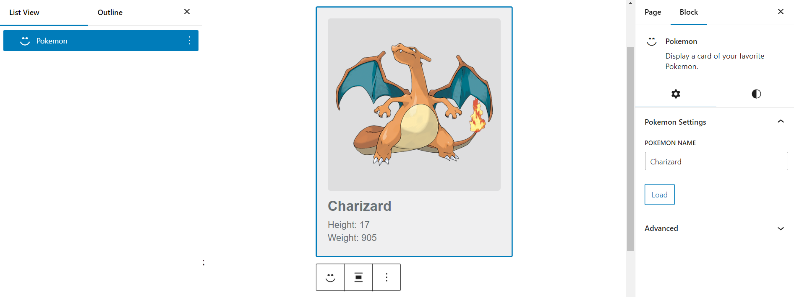

# Pokemon Block - WordPress Plugin

A WordPress Gutenberg block plugin that lets you display information about your favorite Pokemon in a customizable card format.

## Description

The Pokemon Block plugin adds a new Gutenberg block to your WordPress editor, allowing you to:

- Search for any Pokemon by name
- Display a card with the Pokemon's official artwork
- Show key Pokemon stats (name, height, weight)
- Customize the appearance with WordPress block styling options

This plugin utilizes the [PokeAPI](https://pokeapi.co/) to fetch Pokemon data dynamically, making it easy to display information about any of the 1000+ Pokemon available.

## Features

- **Dynamic Pokemon Search**: Enter any Pokemon name and load its data instantly
- **Responsive Design**: Card adapts to different screen sizes
- **Customization Options**:
  - Alignment controls
  - Background color options
  - Text color options
  - Margin and padding settings
- **Error Handling**: Clear feedback when Pokemon names are not found
- **Loading State**: Visual indicator during API requests
- **Clean Interface**: Simple, attractive card design

## Installation

### Manual Installation

1. Download the plugin zip file from the repository
2. Go to your WordPress admin area: Plugins → Add New
3. Click the "Upload Plugin" button at the top of the page
4. Choose the downloaded zip file and click "Install Now"
5. Activate the plugin through the 'Plugins' screen in WordPress

### Via Directory

1. Upload the plugin files to the `/wp-content/plugins/pokemon` directory
2. Activate the plugin through the 'Plugins' screen in WordPress

## Usage

1. Create or edit a post/page in the WordPress block editor
2. Click the "+" button to add a new block
3. Search for "Pokemon" and select the Pokemon block
4. The block will initially load with Pikachu as the default Pokemon
5. To change the Pokemon:
   - Click on the block to select it
   - Use the sidebar settings panel to enter a different Pokemon name
   - Click the "Load" button to fetch the data
6. Style your Pokemon card using the standard WordPress block controls:
   - Use the alignment toolbar to position the card
   - Change background and text colors in the sidebar
   - Adjust spacing using the block dimensions panel

## Customization

The Pokemon Block supports the following WordPress block customization options:

- **Alignment**: Left, center, right, wide, and full width
- **Colors**:
  - Background color
  - Text color
- **Spacing**:
  - Padding
  - Margin

## Development

This plugin was built using the WordPress Create Block script, which sets up the necessary build tools and project structure.

### Development Requirements

- Node.js
- npm

### Development Commands

```bash
# Install dependencies
npm install

# Start development mode
npm start

# Build for production
npm run build

# Create a plugin zip file
npm run plugin-zip
```

### File Structure

- `pokemon.php` - Main plugin file
- `src/` - Source code
  - `edit.js` - Block editor component
  - `index.js` - Block registration
  - `render.php` - PHP rendering for front-end
  - `style.scss` - Styles for both editor and front-end
  - `editor.scss` - Editor-only styles
  - `block.json` - Block configuration

## Technical Details

- Uses WordPress Block API v3
- Built with React for the editor interface
- Fetches data from the [PokeAPI](https://pokeapi.co/)
- Renders server-side in PHP for optimal performance

## Credits

- Pokemon data provided by [PokeAPI](https://pokeapi.co/)
- Pokemon images from the official Pokemon artwork collection
- Plugin scaffolding created with [Create Block](https://developer.wordpress.org/block-editor/reference-guides/packages/packages-create-block/)

## License

This plugin is licensed under the GPL v2 or later.

## Changelog

### 0.1.0
- Initial release
- Basic Pokemon card display
- Search and load functionality
- Style customization options

## Screenshots


